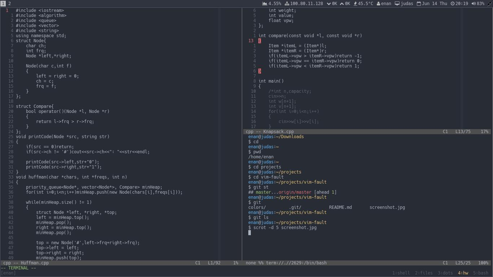

# Fault
---

## Story behind this great name

I heavily believe that the default colorscheme in vim should be very minimal.
But since that's not the case and most of the people don't have any problem
with it, it seems that it's me who is the problem. That's why I named my
personal colorscheme **fault**, a clever (at least in my view) wordplay on the
faulty default of vim colorscheme.

## Wondering why another colorscheme?

This is not a colorscheme. At least not for you to use yourself. Rather this is
for you to see that you can build your own colorscheme, the one that you always
dreamt of but never quite found in any other colorschemes. Then you started to
add bits of `highlight bla bla bla` in your vimrc. Well, you can, in exchange,
built your very own colorscheme.

Would you settle with other's mistress? Then don't settle with other's
colorscheme. (Unless, she/it is absolutely one of a kind)

## So, how do you get around building yourself one?

  1. First, don't plug this in your vimrc.
  2. Go to `/usr/share/nvim/runtime/colors/`
  3. Find a colorscheme you somewhat like.
  4. Start customizing the hell out of it.
  5. There, you built yourself a colorscheme.

## Screenshot

